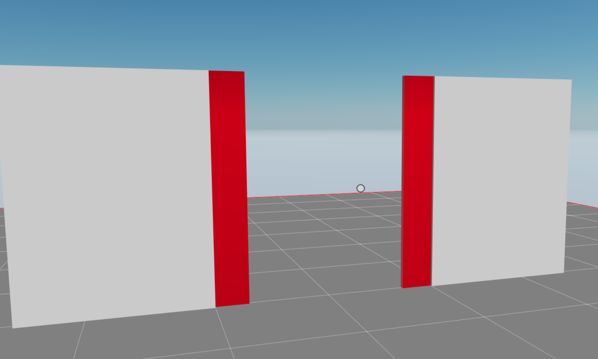

## Sliding doors

A simple interactive scene with a two-sided door that can be opened by clicking.




This scene shows you:

- How to add primitive shapes and apply materials to them
- How to handle click events
- How to use the [utils library](https://www.npmjs.com/package/decentraland-ecs-utils) to move an entity gradually
- How to use the toggle component from the utils library to alternate something between two states
- How to arrange entities into parents and children

## Try it out

**Install the CLI**

Download and install the Decentraland CLI by running the following command:

```bash
npm i -g decentraland
```

**Previewing the scene**

Download this example and navigate to its directory, then run:

```
$:  dcl start
```

Any dependencies are installed and then the CLI opens the scene in a new browser tab.

**Scene Usage**

Click on the door to open both sides at once.


Learn more about how to build your own scenes in our [documentation](https://docs.decentraland.org/) site.

If something doesn’t work, please [file an issue](https://github.com/decentraland-scenes/Awesome-Repository/issues/new).

## Copyright info

This scene is protected with a standard Apache 2 licence. See the terms and conditions in the [LICENSE](/LICENSE) file.
